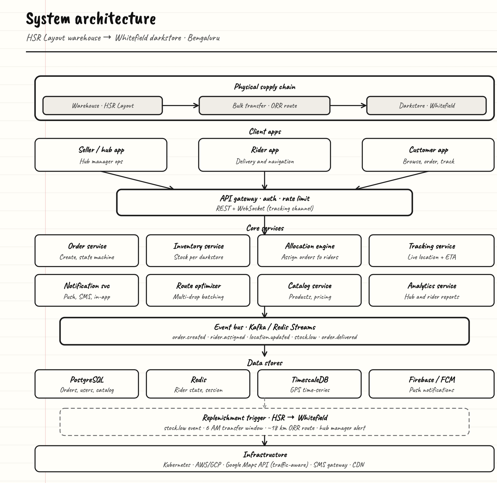
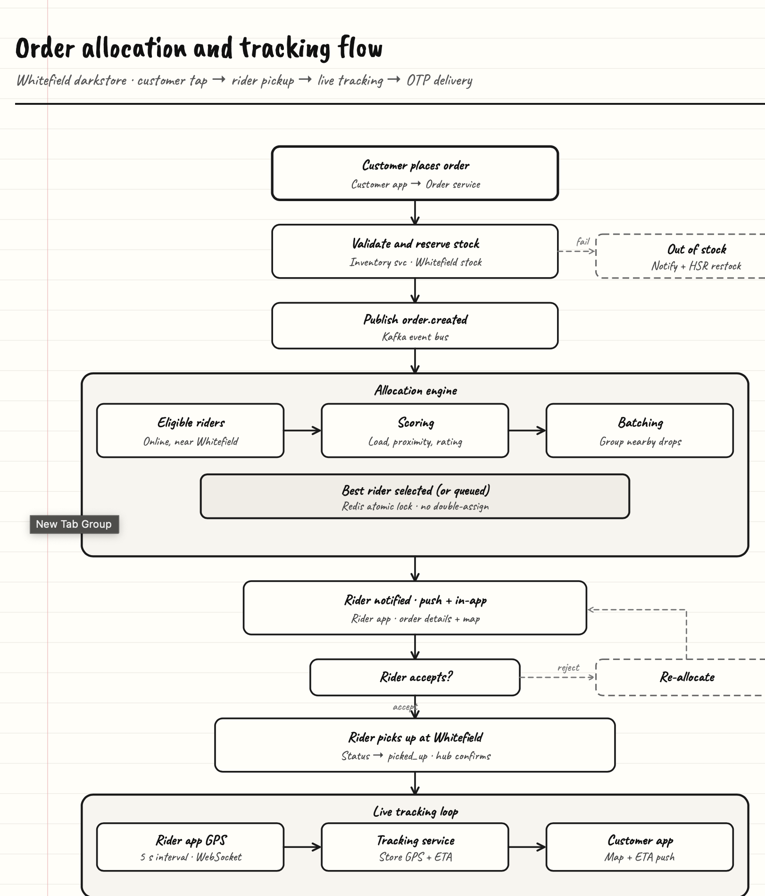
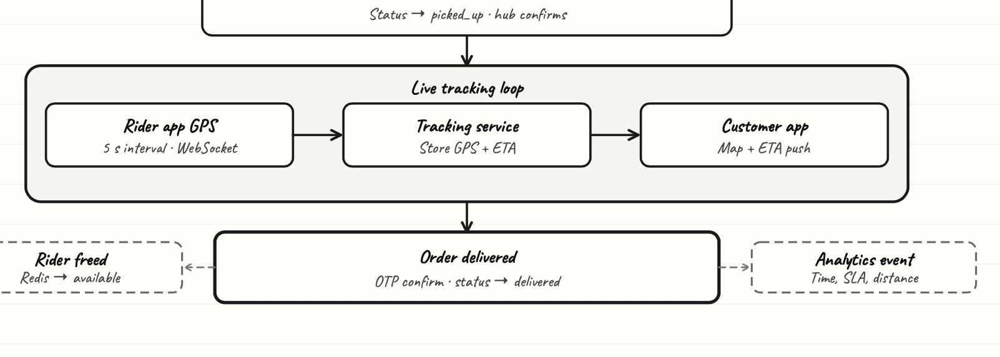

# allocation engine arch

plant delivery platform — **nursery warehouse (hsr) → zone hub (whitefield) → customer doorstep**. we deliver **within a day**, not instant quick-commerce. flow: customer places order → hub pickup → live tracking → otp delivery.

---

## system architecture

plants move from the main nursery warehouse to the zone hub over the orr route. seller/hub, delivery partner, and customer apps connect through the api gateway (auth, rate limits, rest + websocket for tracking).

**core services:** order (create + state machine), inventory (plant stock per hub), allocation engine (assign delivery partners for the day), tracking (live location + delivery window eta), notification (push/sms/in-app), route optimizer (multi-stop batching for same-day runs), catalog (plants, pots, pricing), analytics.

**event bus (kafka / redis streams):** `order.created`, `rider.assigned`, `location.updated`, `stock.low`, `order.delivered`.

**data:** postgresql (orders, users, catalog), redis (partner state, sessions), timescaledb (gps time-series), firebase/fcm (push).

**replenishment:** low plant stock at the hub triggers nursery → hub transfer (~18 km orr, scheduled morning window, hub manager alert).

**infra:** kubernetes, aws/gcp, google maps (traffic-aware), sms gateway, cdn.

**delivery promise:** orders allocated and routed for **same-day delivery** — cut-off based, not minutes-level quick commerce.

---

## order allocation + tracking flow

**part 1** — customer order through hub pickup.

customer app → order service → inventory reserves plants at the zone hub. out of stock → notify nursery for restock. `order.created` on kafka feeds the allocation engine: eligible partners (online, near hub), scoring (load, proximity, rating), batching nearby drops for the day’s route, best partner via redis atomic lock (no double-assign). partner gets push + in-app map. reject → re-allocate; accept → pickup at hub, `picked_up`, hub confirms plants loaded.

**part 2** — live tracking through delivery.

partner gps over websocket → tracking service stores location + **day delivery eta** → customer app map + eta push. otp confirms handover, status `delivered`. partner freed in redis (`available`). analytics logs time, sla (within-day target), distance.

---

## quick ref

| piece | role |
|-------|------|
| allocation engine | score, batch, lock, assign partners for day delivery |
| tracking service | gps stream, eta window, customer updates |
| inventory svc | plant stock per hub + reserve on order |
| redis | partner state, allocation locks |
| kafka | async domain events |

repo: https://github.com/Akhilesh29/allocation-engine-arch
